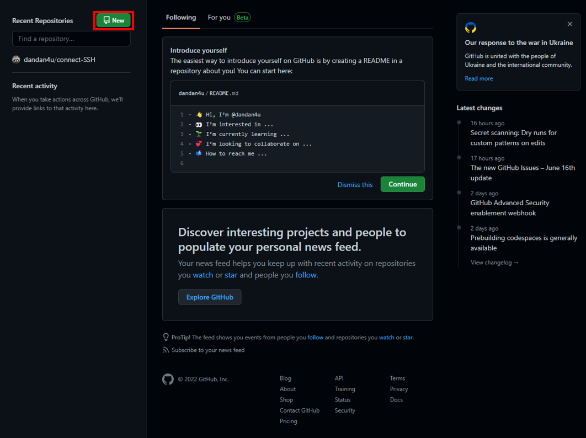
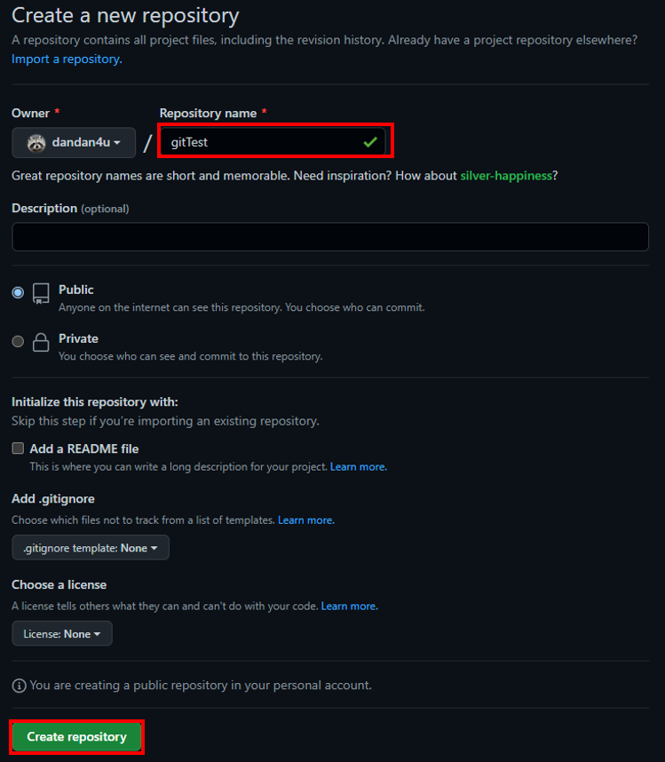

# chapter1

### Resources

- [Resources to learn Git](https://try.github.io)

#### 깃허브

- 형상관리란?  
소프트웨어의 변경사항을 체계적으로 추적하고 통제하는 것  
  
- 깃과 깃허브의 차이?  
Git : CVS(Concurrent Version System), SVN(SubVersioN)과 같은 "형상 관리 도구(버전 관리 시스템)" 들 중 하나
Github : Git이라는 형상관리 도구의 백업공간(원격 저장소, 온라인 저장소)  
  
- 깃허브란?  
2005년, 리눅스의 창시자 리누스 토르발스는 깃(Git)을 처음 발표 이후,
리눅스 개발자들이 리눅스의 소스코드를 관리하는데 Git을 사용하기 시작,
현재는 리눅스 뿐만 아니라 다양한 소프트웨어의 소스코드를 관리하는데 사용,

Github는 Git의 핵심기능 3가지(버전관리, 백업, 협업)중에서, 원격저장소를 통한 협업을 가능하도록 한다.
  
##### 깃허브 사용방법  
- 깃허브에 로그인 한 후, New버튼 클릭한다. 
    

- 레포지토리 이름을 입력한 다음, Create repository을 눌러준다. 
  

- Fork, Pull Request
- Pull, Push, Commit, Merge, Branch
- Issue, Projects, Tag, Release

 

#### markdown `.md`

- 마크다운이란?
- 마크다운의 사용법
  - `<h1/>`, `<code/>`, `<input type='checkbox'/>`, `<li/>`, ``, `>`, `---` 등

### Quest

- chapter1을 작성하기 위한 Branch를 생성해보세요.
- 생성한 Branch에서 문서를 작성하고 merge를 통해 병합해 보세요.
- 생성한 Branch에서 문서를 작성하고 pull request를 통해 병합해 보세요.
- 이번 chapter에서 공부한 내용을 바탕으로 앞으로의 과제를 수행 해주세요.
